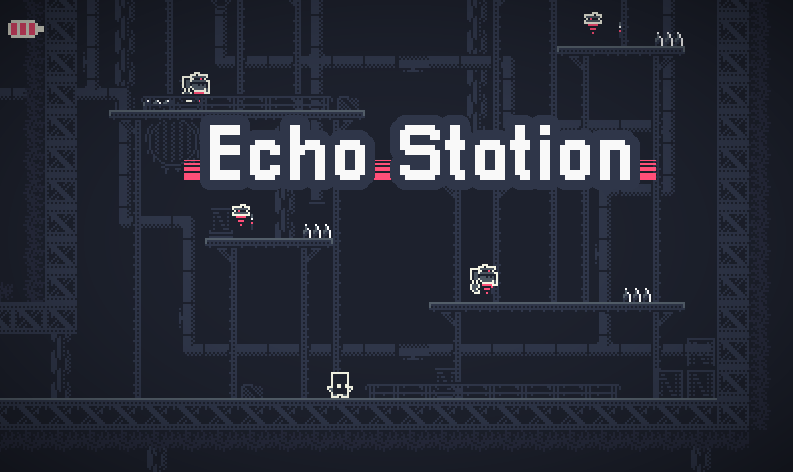

# EchoStation

A 2D platformer about a robot who wakes up alone on an abandoned space station. Made in Godot 3 for Godot Wild Jam 52. My first game made in Godot.

## Play Now

Game is available to download and play for free on Windows, Mac, and Linux at https://dispixel.itch.io/echo-station

  
  

## Features

### Responsive Platforming

Jump, slash, and navigate your way through challenging platforming levels with a variety of different obstacles and mechanics!

### Exploration and Narrative

Explore the abandoned space station and unlock new abilities in this mini Metroidvania! Uncover the story behind the mysterious station!

## Credit
This project uses the following free assets:

- [Industry Tileset](https://0x72.itch.io/16x16-industrial-tileset)

© Nathan Foote | 2023
